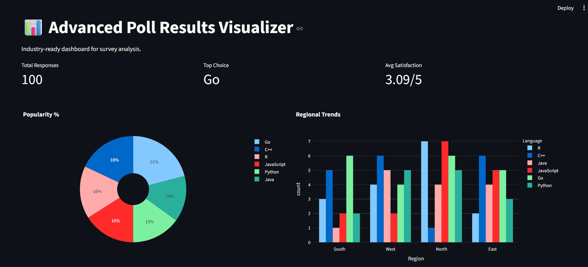
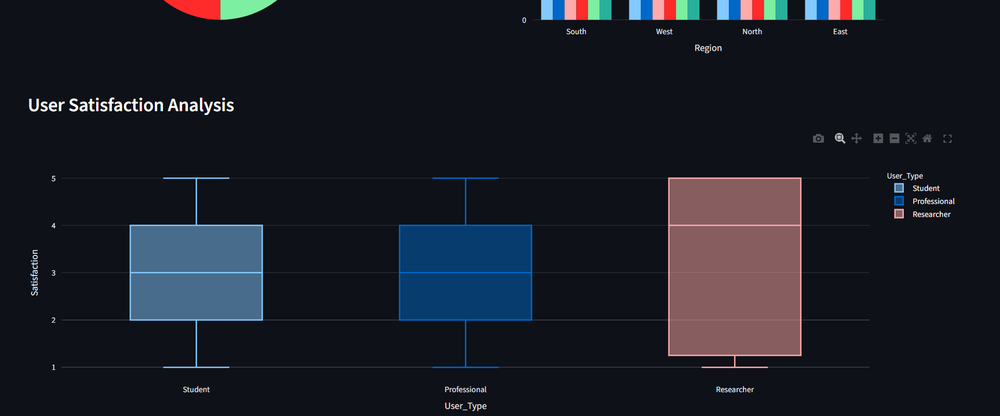
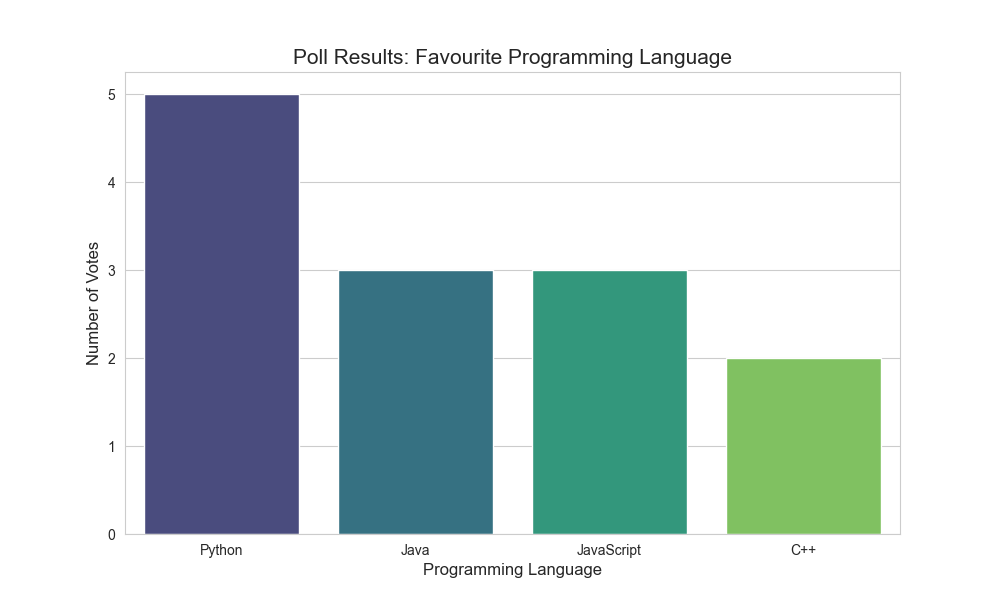

# 📊 Poll Insights Pro: Hybrid Analytics Dashboard

[](https://www.python.org/)
[](https://streamlit.io/)

This project is a high-performance **End-to-End Data Pipeline** that transforms raw survey data into actionable business insights. It features both a static automated reporting tool and a modern interactive web dashboard.

## 📸 Project Visualizations

### 1️⃣ Interactive Dashboard (Streamlit + Plotly)
Live data filtering and interactive charts for deep-dive analysis.



### 2️⃣ Static Analysis Report (Matplotlib + Seaborn)
Automated static reporting generated directly via Python scripts.


## 🌟 Key Features
- **Interactive Dashboard:** Live filtering by Region and User Type using Streamlit.
- **Automated Data Engine:** Custom script to generate large-scale synthetic datasets.
- **Hybrid Visualization:** Supports both dynamic Plotly charts and static exports.
- **Business KPIs:** Real-time tracking of Satisfaction Scores and Popularity Trends.

## 📁 Project Architecture
```text
Poll_Visualizer_Project/
├── app.py              # Advanced Interactive Dashboard (Web UI)
├── main.py             # Core script for Static Image Generation
├── data_generator.py   # Script to build the poll dataset
├── dashboard_ss.png    # Dashboard Screenshot (Main Folder)
├── poll_results.png    # Static Graph Screenshot (Main Folder)
├── requirements.txt    # Project dependencies
├── README.md           # Documentation
└── data/               # Source: poll_data.csv

## 🚀 How To Run (Execution Steps)
Follow these steps in sequence to set up and run the project:

1. Install Dependencies
Bash
pip install -r requirements.txt
2. Generate the Dataset
Bash
python data_generator.py
3. Generate Static Report
Bash
python main.py
4. Launch the Interactive Dashboard
Bash
streamlit run app.py